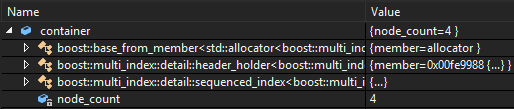
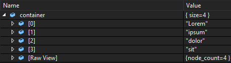

# Boost Multi Index Container Natvis
Provides nice visualization during debugging for `boost::multi_index_container` in Visual Studio. Helps to turn this:

into this:

## Usage
Place corresponding `BoostMultiIndex.natvis` file into `%USERPROFILE%\My Documents\Visual Studio [version]\Visualizers`.

## Compatibility:
Visualizators are verified to work with following Boost and Visual Studio versions:
| Index type            | **boost** version | Visual Studio |
|:----------------------|:-----------------:|:-------------:|
| `ordered_index`       | &ge; 1.59         | &ge; 2013     |
| `ranked_index`        | &ge; 1.59         | &ge; 2013     |
| `sequenced_index`     | &ge; 1.50         | &ge; 2013     |
| `random_access_index` | &ge; 1.50         | &ge; 2015     |
| `hashed_index`        | &ge; 1.58         | &ge; 2015     |
